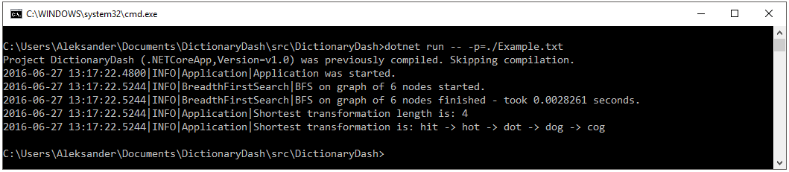

Dictionary Dash
===
> This is project is written using old .net-core preview version. Code is now obsoleted.

Simple application that returns on standard output, length of the shortest word chain where:
 * Only one letter can be changed at a time
 * Each intermediate word must exist in the given dictionary
 * At each step, exactly one character is replaced with another character

## Used technology:
Application was written in `C#` language using `dotnet-core` platform.

**Used SDK**: dotnet-dev-1.0.0-preview1-002702

**Tested on**: Windows 10 x64, .NET Core Docker Image Microsoft/docker:1.0.0-preview1

**Tried and failed on**: Ubuntu 14.0.4 – dotnet installation script provided by MSFT fails (known issue that is not fixed yet, for preview1)

**Remarks**: Running on Windows OS is preferred, .NET core still can misbehave on Unix systems (example: NLogger may have issues with finding configuration file, thus will not display information in console).

## App preparation
It would be best to run both in `src/DictionaryDash` and `src/DictionaryDashTest` command `dotnet restore`, which will retrieve all nuget packages.
This should be done automatically by dotnet command, but as it is only in preview, sometimes it does not do that.

## Running the application:
1. Enter `src/DictionaryDash` directory
2. Run the application: `dotnet run -- -p=<pathToFile>`

> Important!
>
> Do note the '--' between run command and first application argument - it is not typo, without it dotnet cmd will not pass arguments.

## Detailed application description:
Program accepts two arguments: `-h|--help` and `-p|--path=<filepath>`

To find shortest word chain, one should provide the app with path to file that contains dictionary, start and end words.

For example: `dotnet run -- -p=./example.txt` (This file is present in project)

It is assumed that that file will contain all words that should fill dictionary, separated by newline. First word in file is treated as transformation start word, and the second word is treated as target word.

**Note**: All words should be of the same length and consist solely of latin characters [a-z].

## Running application tests:
1. Enter `src/DictionaryDashTest` directory
2. Run tests: `dotnet test`

## Running alternatives:
There is also VisualStudio [plugin](https://go.microsoft.com/fwlink/?LinkId=798481) for integration with `dotnet-core`.
